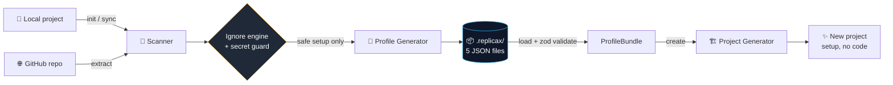

<div align="center">

<h1>ReplicaX</h1>

<h3><em>Copy the setup, not the code.</em></h3>

<p>
  Extract a project's entire development environment — <strong>tooling, folder structure, and conventions</strong> —
  into a portable profile, then recreate it anywhere in seconds.<br/>
  None of your business code. None of your secrets. Just the setup.
</p>

[](https://www.npmjs.com/package/@iamsaroj/replicax)
[](https://nodejs.org)
[](https://www.typescriptlang.org)

[](LICENSE)

<sub>
  <a href="#quick-start"><b>Quick start</b></a> &nbsp;•&nbsp;
  <a href="#commands"><b>Commands</b></a> &nbsp;•&nbsp;
  <a href="#what-gets-captured"><b>What gets captured</b></a> &nbsp;•&nbsp;
  <a href="#security"><b>Security</b></a> &nbsp;•&nbsp;
  <a href="#how-it-works"><b>How it works</b></a> &nbsp;•&nbsp;
  <a href="#faq"><b>FAQ</b></a>
</sub>

</div>

---

> **ReplicaX captures the _setup_ of a project — the parts you copy‑paste between every new repo — and leaves
the _implementation_ behind.**

Every new project starts the same way: copy `tsconfig.json`, port the ESLint and Prettier config, recreate the
Dockerfiles, re‑add the CI workflow, rebuild `src/`'s folder layout. It's slow, error‑prone, and quietly drifts out of
sync across a team.

ReplicaX captures that ritual **once** and replays it **on demand** — locally, or straight from any GitHub repo.

> It is **not** a code generator, a project cloner, or a backup tool.

---

## Why ReplicaX

|                       | Without ReplicaX                           | With ReplicaX                   |
|-----------------------|--------------------------------------------|---------------------------------|
| **New project setup** | 30+ minutes of copy‑paste from an old repo | `replicax create my-app`        |
| **What you copy**     | Whatever you remember to grab              | A complete, validated profile   |
| **Secrets**           | One stray `.env` away from a leak          | Blocked unconditionally         |
| **Team consistency**  | Drifts repo to repo                        | One shareable `.tar.gz` profile |
| **Source code**       | Tangled up with the config                 | Never touched                   |

---

## Features

|                               |                                                                                                                  |
|-------------------------------|------------------------------------------------------------------------------------------------------------------|
| **One‑command capture**       | `init` scans the current project into a reusable profile.                                                        |
| **Capture any GitHub repo**   | `extract owner/repo` profiles a remote repo — no clone, no `git` required.                                       |
| **One‑command scaffold**      | `create` reproduces the setup in a fresh directory.                                                              |
| **AI assistant skills**       | `init-skill` uses your own AI (Claude · Codex · Gemini) to author a ready‑to‑use skill for agentic coding tools. |
| **`.ts` _and_ `.js` configs** | Copied byte‑for‑byte — never compiled, never executed.                                                           |
| **Secret‑safe by design**     | `.env`, keys, and certs can never enter a profile; `.npmrc` tokens are stripped automatically.                   |
| **No business code**          | Folders are recreated empty; source files are never read.                                                        |
| **Stays in sync**             | `sync --diff` shows what drifted; `validate` verifies integrity via SHA‑256.                                     |
| **Portable & shareable**      | `export` / `import` a whole profile as a single `.tar.gz`.                                                       |
| **`.replicaxignore`**         | gitignore‑style control over exactly what gets captured.                                                         |

---

## Installation

```bash
npm install -g @iamsaroj/replicax
# or
pnpm add -g @iamsaroj/replicax
```

> **Requires Node.js 20+.** ReplicaX is a standalone CLI with zero external services.

---

## Quick start

```bash
# 1 — In an existing, well-configured project
cd my-project
replicax init                  # → writes a profile to .replicax/

# 2 — Anywhere the profile lives, scaffold a fresh project
replicax create my-new-app     # → same setup, none of the code
```

…and here's what `init` actually shows you:

```console
$ replicax init

✔ Scanned 14 config file(s) and 9 director(ies)

ℹ Captured setup
  language       typescript
  framework      react
  packageManager npm
  nodeVersion    20.x

ℹ Tooling (14 files)
  Build Tools                      1
  CI/CD                            1
  Docker                           2
  Editor                           1
  Formatting                       1
  Git                              1
  Git Hooks                        1
  Language & Type Checking         3
  Linting                          1
  Testing                          1
  package.json                     1

ℹ Structure (9 directories)
my-app/
├── .github/
│   └── workflows/
├── .husky/
├── public/
└── src/
    ├── components/
    ├── hooks/
    ├── pages/
    └── services/

✔ Profile "my-app" written to .replicax/
  Create a project from it with: replicax create <project-name>
```

> 💡 **Tip:** run `replicax init --dry-run` first to preview exactly what would be captured — nothing is written.

---

## Before & After

Starting from a typical **Vite + React + TypeScript** project, `replicax init && replicax create my-new-app` produces a
clean skeleton — same tooling, zero application code, zero secrets.

<table>
<tr>
<th align="left">📁 Source project</th>
<th align="left">✨ Generated by ReplicaX</th>
</tr>
<tr>
<td valign="top">

<pre>
my-project/
├── vite.config.ts
├── tsconfig.json
├── tsconfig.node.json
├── .prettierrc
├── eslint.config.js
├── Dockerfile
├── docker-compose.yml
├── .github/workflows/ci.yml
├── .husky/pre-commit
├── .env                  ← secret
├── package.json          ← runtime deps
└── src/
    ├── components/
    │   └── Button.tsx     ← business code
    ├── hooks/
    ├── services/
    │   └── UserService.ts ← business code
    └── pages/
</pre>

</td>
<td valign="top">

<pre>
my-new-app/
├── vite.config.ts        ✓ verbatim
├── tsconfig.json         ✓
├── tsconfig.node.json    ✓
├── .prettierrc           ✓
├── eslint.config.js      ✓
├── Dockerfile            ✓
├── docker-compose.yml    ✓
├── .github/workflows/ci.yml
├── .husky/pre-commit     ✓
├── package.json          ✓ curated
└── src/
    ├── components/        ✓ EMPTY
    │
    ├── hooks/             ✓ EMPTY
    ├── services/          ✓ EMPTY
    │
    └── pages/             ✓ EMPTY
</pre>

</td>
</tr>
</table>

No `.env`. No `Button.tsx`. No `UserService.ts`. No `react` runtime dependency. **Only the setup.**

---

## Commands

| Command                                                                              | What it does                                       |
|--------------------------------------------------------------------------------------|----------------------------------------------------|
| [`replicax init`](#replicax-init)                                                    | Scan the current project → profile in `.replicax/` |
| [`replicax extract <repo>`](#replicax-extract-repo)                                  | Profile a **remote GitHub repo** (no clone)        |
| [`replicax create <name>`](#replicax-create-project-name)                            | Scaffold a new project from a profile              |
| [`replicax sync`](#replicax-sync)                                                    | Update the profile from the current project        |
| [`replicax inspect`](#replicax-inspect)                                              | Display captured config & structure                |
| [`replicax validate`](#replicax-validate)                                            | Schema + integrity (SHA‑256) check — CI‑friendly   |
| [`replicax export`](#replicax-export--import) / [`import`](#replicax-export--import) | Portable `.tar.gz` profile in/out                  |
| [`replicax init-skill`](#replicax-init-skill)                                        | Author an AI‑assistant skill from your stack       |
| [`replicax doctor`](#replicax-doctor)                                                | Check which dev tools are installed locally        |
| [`replicax compare <a> <b>`](#replicax-compare-source-target)                        | Diff two profiles/projects: tooling, config, …     |
| [`replicax audit`](#replicax-audit)                                                  | Score a setup vs best practices + recommendations  |

> Every write operation accepts `--dry-run` (preview, touch nothing) and `--verbose` (list every file).

### `replicax init`

Scan the current project and write a profile to `.replicax/`.

```bash
replicax init --name "react-enterprise"   # name the profile
replicax init --dry-run                    # preview, write nothing
replicax init --verbose                    # list every detected file
```

### `replicax extract <repo>`

Capture a profile from a **remote GitHub repository** instead of the current directory — the same scan as `init`,
pointed at a repo you don't even have checked out. The repo is downloaded as a tarball over the GitHub API (no `git`
required) into a temp directory, scanned, then discarded; only the profile is kept.

```bash
replicax extract khanalsaroj/typegen-ui                     # owner/repo shorthand
replicax extract https://github.com/khanalsaroj/typegen-ui  # or a full URL
replicax extract owner/repo --ref develop                   # a branch, tag, or commit
replicax extract owner/repo#v1.2.3                          # ref via #fragment / @tag too
replicax extract owner/repo --name react-enterprise         # name the profile
replicax extract owner/repo --out ./profiles/react          # write .replicax elsewhere
replicax extract owner/repo --dry-run                       # preview, write nothing
```

Accepts `owner/repo`, a `github.com` URL (including `/tree/<branch>` links), an ssh remote, or a `#branch` / `@tag`
suffix.

> **Private repos & rate limits:** set `GITHUB_TOKEN` (or `GH_TOKEN`) in your environment — it's read from the
> environment, used for the one request, and **never stored**. The same secret guard applies, so a remote repo's
`.env` /
> keys are never captured.

### `replicax create <project-name>`

Create a new project from a profile. Existing files trigger an interactive overwrite/skip prompt (auto‑skips when
non‑interactive).

```bash
replicax create my-app
replicax create my-app --profile ./shared/.replicax   # use a profile elsewhere
replicax create my-app --skip-install                  # don't run the package manager
replicax create my-app --force                         # overwrite conflicts, no prompt
replicax create my-app --dry-run                        # preview the file plan
```

### `replicax sync`

Re‑scan and update the profile to match the current project.

```bash
replicax sync           # update, print a change summary
replicax sync --diff    # detailed per-file added/changed/removed list
replicax sync --force   # rewrite even if nothing changed
```

### `replicax inspect`

Display the captured configuration and structure.

```bash
replicax inspect
replicax inspect --json                  # machine-readable (stdout only)
replicax inspect --section tooling       # profile | tooling | structure | metadata
```

```text
Tooling (14 file(s))
┌────────────────────────────────┬──────────────────────────┬─────────┬──────────┐
│ Category                       │ File                     │ Variant │ Size     │
├────────────────────────────────┼──────────────────────────┼─────────┼──────────┤
│ Language & Type Checking       │ tsconfig.json            │ json    │ 226 B    │
│ Build Tools                    │ vite.config.ts           │ ts      │ 98 B     │
│ Formatting                     │ .prettierrc              │ other   │ 63 B     │
│ …                              │ …                        │ …       │ …        │
└────────────────────────────────┴──────────────────────────┴─────────┴──────────┘
```

### `replicax validate`

Check the profile's schema and integrity (SHA‑256 checksums + path safety). Exits non‑zero on failure — handy in CI.

```bash
replicax validate
```

### `replicax export` / `import`

Package a profile into a portable archive and adopt it elsewhere.

```bash
replicax export --out ./react-enterprise.tar.gz
replicax import ./react-enterprise.tar.gz          # validates before adopting
replicax import ./react-enterprise.tar.gz --force  # overwrite an existing profile
```

### `replicax init-skill`

Generate an AI‑assistant **skill** from the current project — a ready‑to‑use bundle (an entry `SKILL.md` plus optional
`references/`) that teaches an assistant the tech stack, the install/build/test/lint commands, the tooling, and the
folder layout, written where your assistant looks for skills.

It uses **whatever AI you already have configured**. ReplicaX prefers a locally installed CLI (reusing its login) and
falls back to a provider API key from your environment — it never stores credentials:

| Provider | CLI (preferred) | API key (fallback)                  | API model default  |
|----------|-----------------|-------------------------------------|--------------------|
| `claude` | `claude -p`     | `ANTHROPIC_API_KEY`                 | `claude-opus-4-8`  |
| `openai` | `codex exec`    | `OPENAI_API_KEY`                    | `gpt-5.5`          |
| `gemini` | `gemini`        | `GEMINI_API_KEY` / `GOOGLE_API_KEY` | `gemini-3.5-flash` |

```bash
replicax init-skill --target claude                            # auto-detect provider, author the skill
replicax init-skill --target codex --provider gemini           # force a specific provider
replicax init-skill --target claude --model claude-sonnet-4-6  # override the API model
replicax init-skill --target claude --no-ai                    # skip AI; use the built-in template
replicax init-skill --target claude --dry-run                  # preview (no AI call, nothing written)
replicax init-skill --target claude --force                    # overwrite existing skill files
```

**Targets** (`--target`, required) control the on‑disk _format/location_: `claude` → `.claude/skills/<name>/SKILL.md`,
`codex` → `.codex/skills/<name>/SKILL.md`, `antigravity` → `.agents/skills/<name>.md`. The **provider** (auto‑detected,
or forced with `--provider`) is the AI that _authors_ it — the two are independent.

> **Bring your own template.** If the project root has a `SKILL.md`, `init-skill` hands it to the AI as the **base** to
> refine — the model preserves your headings, structure, and instructions and fills them in from the detected setup,
> instead of starting from scratch.

> **Privacy:** only the project's _setup_ is sent to the provider — the same safe surface ReplicaX captures (config
> files, structure, `package.json` scripts/deps). Source code and secrets are never sent. With `--no-ai` (or no provider
> configured), ReplicaX falls back to a deterministic, fully offline template.

### `replicax doctor`

Report which developer tools are installed locally — runtimes, package managers, Docker, and editors — with versions.
Cross‑platform and read‑only; a missing tool is a finding, not an error.

```bash
replicax doctor
replicax doctor --json     # machine-readable
```

```console
$ replicax doctor
Developer environment

✓ Node.js 22.17.1
✓ Git 2.45.1
✓ npm 10.2.0
✗ Docker not found
✓ Claude Code 2.1.0

8/11 tools found
```

### `replicax compare <source> <target>`

Diff two profiles — or two project directories — across tooling, configuration files, `package.json`, structure, and
metadata. Each argument may be a `.replicax` profile, a directory containing one, or a plain project folder (scanned on
the fly), so you can compare anything against anything.

```bash
replicax compare ./examples/react-vite ./examples/nextjs-enterprise
replicax compare ./my-app ./other-app --json
```

```text
Added:
  + Docker (Tooling)
  + src/api (Structure)
Removed:
  - Jest (Tooling)
Changed:
  ~ eslint.config.js (Configuration files)
  ~ language: javascript → typescript (Metadata)
```

### `replicax audit`

Score a project's setup against best‑practice rules — linting, formatting, testing, git hooks, CI/CD, containerization —
and get concrete recommendations for what's missing. Scans the current directory by default, or evaluates a stored
profile with `--profile`.

```bash
replicax audit
replicax audit --path ./some/project
replicax audit --profile ./examples/nextjs-enterprise/.replicax --json
```

```text
Project Score: 60/100

✓ Formatting
✓ Testing
✗ Git hooks
✗ Containerization

Missing:
  - Git hooks
  - Containerization

Recommendations:
  - Add Husky to run checks before each commit.
  - Add a Dockerfile to containerize the application.
```

> `compare` and `audit` build on the detection engine: every scan now reports the **detected stack** (React, TypeScript,
> Docker, GitHub Actions, …) with a confidence score, persisted in the profile and viewable via `inspect --section
> detections`.

---

## What gets captured

| Captured ✅                                          | Left behind ❌                                                  |
|-----------------------------------------------------|----------------------------------------------------------------|
| TS/JS configs, ESLint, Prettier                     | Application source (components, services, controllers)         |
| Vite / Webpack / Rollup / esbuild                   | Runtime `dependencies` in `package.json`                       |
| Tailwind / PostCSS                                  | `.env*`, `*.pem`, `*.key`, certificates                        |
| Docker, CI/CD (Actions, GitLab, CircleCI, Jenkins)  | `node_modules/`, `dist/`, `build/`, `coverage/`, `.next/`, …   |
| `.editorconfig`, Husky hooks                        | IDE folders (`.vscode/`, `.idea/`, `.vs/`, `.fleet/`, `.zed/`) |
| Test configs (Vitest/Jest/Playwright/Cypress)       | Anything matched by `.replicaxignore`                          |
| Monorepo files, commitlint/lint‑staged/release/knip |                                                                |
| JVM build (Maven/Gradle) + Spring `application.*`   | Compiled output (`target/`, `*.class`), the gradle wrapper JAR |
| Folder hierarchy (directories only)                 | Folder _contents_                                              |

**`package.json` is curated, not copied.** Only `scripts`, `devDependencies`, `engines`, `type`, `packageManager`, and
config blocks like `lint-staged` are kept. Runtime `dependencies` are deliberately dropped (that's your application),
and the new project's name is stamped in on `create`.

Both `.ts` and `.js` config variants work because ReplicaX copies them **verbatim** — it never needs to compile or
execute a config to capture it.

---

## Security

ReplicaX treats secret exclusion as a **hard guarantee, not a best effort.**

> 🛡️ **Secrets are never captured.** `.env`, `.env.*`, `*.pem`, `*.key`, `*.crt`, SSH keys, and friends are blocked *
*unconditionally** — this cannot be overridden by configuration.

> 🧼 **`.npmrc` is sanitized.** It's a legitimate setup file, but auth tokens (`_authToken`, `_password`, …) are stripped
> out before it enters a profile.

> 🚧 **No path escapes.** Every path read from a profile (or from an AI response) is validated against traversal (`..`)
> and absolute paths before anything is written, so a malicious profile can never write outside its target directory.
`validate` re‑checks this.

The same guarantees apply to `extract` — a remote repo's secrets are filtered exactly as a local project's are.

---

## Configuration — `.replicaxignore` and `.replicaxinclude`

**`.replicaxignore`** controls what gets *excluded*, with **gitignore syntax**. `init` can scaffold a starter for you.
Ignored files are excluded from the profile — but their parent directories are still captured for structure.

```gitignore
# Business logic (folders kept, contents dropped)
src/services/**
src/**/*.ts

# Extra secrets / noise
.env
*.log
```

**`.replicaxinclude`** is the opposite: a list of **glob patterns** (one per line, `#` comments) for *extra* files to
capture verbatim, on top of the auto-detected catalogue. Use it for config ReplicaX doesn't recognize by default
(`*.toml`, a `config/` directory, an IDE file you do want shared, …). A trailing `/` means "the whole directory".

```gitignore
# Capture these in addition to the auto-detected setup
app.config.toml
config/**
.vscode/extensions.json
```

**Precedence** (highest first): the **secret guard** always wins (a secret can never be included) →
**`.replicaxignore`** (your excludes beat your includes) → **`.replicaxinclude`** (overrides the default prune/ignore
lists, so it can reach normally-skipped locations) → the **built-in catalogue**.

---

## Profile format

A profile is five required JSON files under `.replicax/`, plus an optional manifest:

```text
.replicax/
├── profile.json     # identity & metadata (name, version, timestamps)
├── tooling.json     # every captured config file (verbatim) + the package.json template
├── structure.json   # folder hierarchy (sorted POSIX directory paths)
├── metadata.json    # node version, package manager, framework, language + detected stack
├── checksum.json    # SHA-256 integrity hashes
└── manifest.json    # content-free index of artifacts (path, category, size, hash)
```

All files are schema‑validated (zod) on load; `validate` additionally re‑checks checksums and rejects unsafe paths.

**Schema version 2.1.0** added the detected stack (`metadata.detections`), an optional `registry` block (for future
registry support), and `manifest.json` — all backward‑compatible. Profiles written by older ReplicaX (2.0.0) are
**migrated automatically on load** and the manifest is synthesized when absent, so existing profiles keep working.

---

## How it works



- **Scanner** detects config files (via a glob catalogue), the folder hierarchy, and project metadata (package manager,
  framework, language).
- **Ignore engine** layers default ignores + `.replicaxignore`, with a separate, **non‑overridable secret guard**.
- **Profile generator** assembles the bundle and computes checksums.
- **Project generator** reproduces the setup, adapting names/paths, with a **conflict resolver** for existing files.

---

## Development

```bash
npm install
npm run build         # tsup → dist/index.js (single ESM file, with shebang)
npm run typecheck     # tsc --noEmit (covers src AND tests)
npm test              # vitest (real temp-dir fixtures, no mocks)
npm run format        # prettier --write .
npm run dev           # tsup --watch
```

```bash
# Run a single test file, or by name:
npx vitest run tests/scanner.test.ts
npx vitest run -t "sanitizes a captured .npmrc"
```

<details>
<summary><b>Toolchain notes &amp; gotchas</b></summary>

<br/>

**Lockfile.** `package-lock.json` is maintained with **npm 10** (what CI's Node 20/22 ship with). On npm 11+, regenerate
with `npx npm@10 install` when changing dependencies — npm 11 resolves a different tree and will desync `npm ci`.

**Path alias.** Imports use a `@/*` → `src/*` alias resolved by tsc, tsup/esbuild, and the `vite-tsconfig-paths` vitest
plugin. The build bundles to one file, so the alias never reaches the published output.

**Stack.** TypeScript 5 · Node 20+ · ESM · commander · fast‑glob · fs‑extra · ignore · zod · tar · picocolors · ora ·
@inquirer/prompts · cli‑table3 · vitest · tsup · prettier.

**Audit note.** `npm audit` flags `esbuild` (a build‑time transitive of `tsup`). The advisory concerns esbuild's dev
server, which ReplicaX never runs, and esbuild is not part of the published runtime (`dist/`). Fixing it requires a
breaking tsup downgrade, so the toolchain is left intact.

</details>

---

## FAQ

<details>
<summary><b>Does it copy my source code?</b></summary>
<br/>
No. Only configuration files and the empty folder hierarchy. Application code is never read into a profile.
</details>

<details>
<summary><b>What about <code>.ts</code> config files like <code>vite.config.ts</code>?</b></summary>
<br/>
Fully supported — they're copied as text, so both <code>.ts</code> and <code>.js</code> variants work without any compile step.
</details>

<details>
<summary><b>Can a profile leak a secret?</b></summary>
<br/>
No. Secret exclusion is unconditional and <code>.npmrc</code> tokens are stripped; <code>validate</code> will fail if a secret ever appears in a profile.
</details>

<details>
<summary><b>Why are runtime <code>dependencies</code> dropped from <code>package.json</code>?</b></summary>
<br/>
They're part of your application, not your setup. <code>devDependencies</code>, <code>scripts</code>, and <code>engines</code> are kept.
</details>

<details>
<summary><b>Does <code>extract</code> need <code>git</code> installed?</b></summary>
<br/>
No. It downloads the repo as a tarball over the GitHub API using Node's built-in <code>fetch</code> — no <code>git</code> binary, no full clone.
</details>

<details>
<summary><b>Is it cross-platform?</b></summary>
<br/>
Yes — Windows (native + WSL), macOS, and Linux.
</details>

---

## License

**MIT** — see [LICENSE](LICENSE).

<div align="center">
<br/>
<sub><i>ReplicaX — copy the setup, not the code.</i></sub>
</div>
